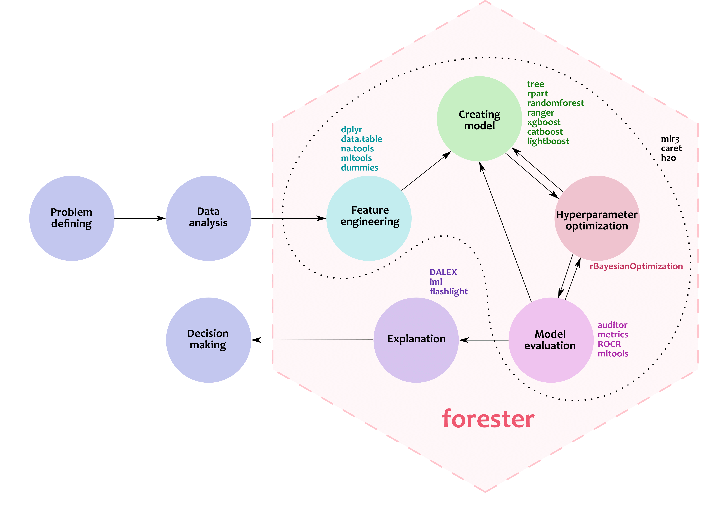

# _Trees are all you need_ - Automated machine learning based on tree models 
Mentor: Anna Kozak, [Google Scholar](https://scholar.google.pl/citations?user=JIrqf9kAAAAJ), [GitHub](https://github.com/kozaka93), [LinkedIn](https://www.linkedin.com/in/kozakanna)

**TL;DR**: Work based on writing a R package to automatically build tree models. More about [forester](https://github.com/ModelOriented/forester).

### Why is the project important?

Today, much of the focus in data science is on producing the best results in the shortest amount of time. However, when building models in a responsible way, we should pay attention to understanding the data and especially the domain. Automated data mining based on automatically built tree-based models is a solution to this problem. It is worth noting, however, that such a solution is a good first step to the analysis of the problem identified, but it should be remembered that the experience and domain knowledge of the data scientist is invaluable.  

### What shall be completed by the end of the project?

The goal is to prepare an R `forester` package that supports the preparation of tree-based models in an automated way. 

Aspects of the work:

- fully implemented ML models , documentation, tests and a website describing the solution
- 
(\*) additional elements related to autoEDA

(\*) running quality experiments on the solution

### What will the intern(s) learn during the summer project?

- Experience in programming in R: writing package structure, documentation, tests. 
- Application of good practices in using version control (GitHub), code review. 
- To be familiar with the specification of research work. 
- Practical aspects of scientific communication.

###  Follow-up

* Collaborating on writing a research paper / a conference proceeding.
* The topic can be used for the diploma thesis.

### Requirements

- R (no need to know how to write R packages)
- Knowledge of tree-based machine learning models - nice to have
